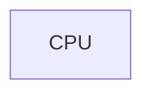
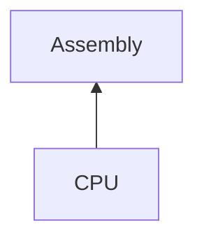
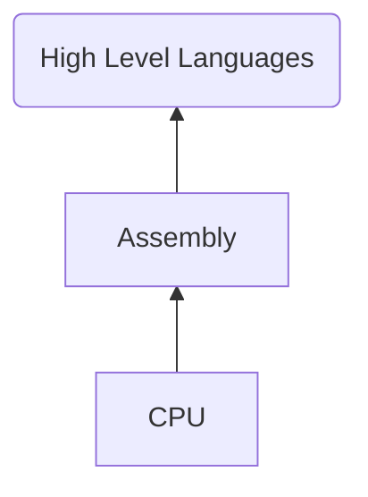
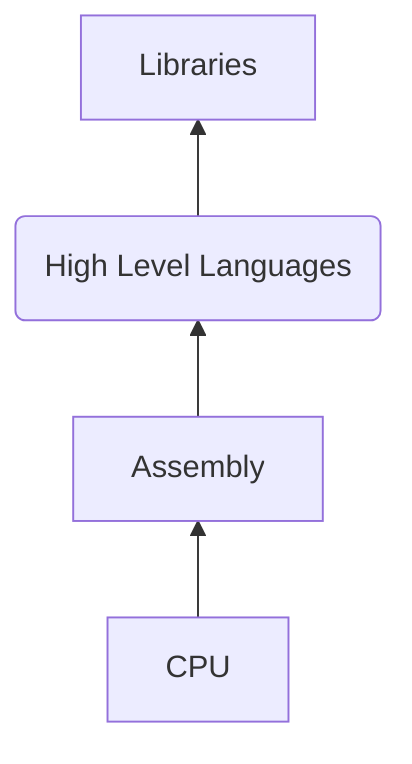
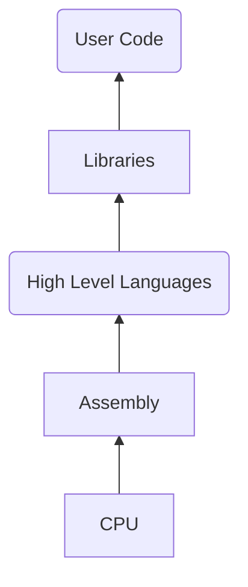
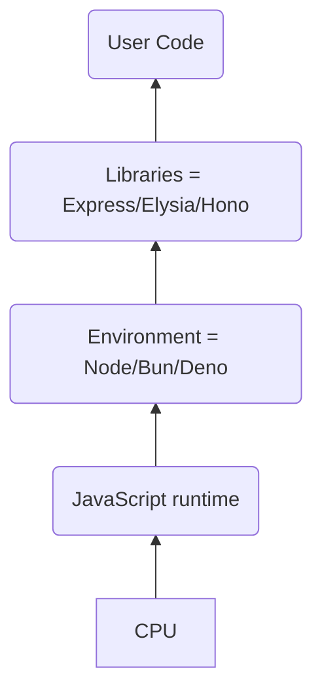
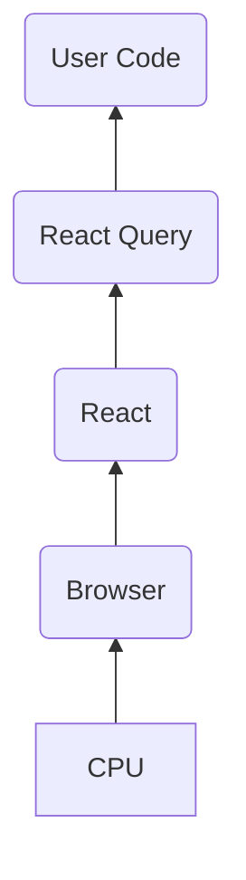

# Designing APIs for React

<br>
<v-click>

#### How we shipped an SDK for **React**

</v-click>
<br><br><br><br><br>
<a href="https://twitter.com/ekaansh" target=_blank>@ekaansh</a>

---
layout: two-cols
---

<div style="display: flex; place-items: center;flex-direction:column"> 

# About me

<br>


### Ekaansh Arora

</div>

::right::
<br> <br> <br> <br>
<div style="display: flex; place-items: center;flex-direction:column"> 

- Developer Advocate, <a style="color: rgba(221, 221, 221)" href="https://agora.io" target=_blank>Agora​</a>

- JavaScript Nerd​

- Maintainer of Agora React (Native) UIKit​

- Maker of 3D art and taylor swift metal covers

<span style="margin:10px"></span>
<span>
<logos-twitter /> <a href="https://twitter.com/ekaansh" target=_blank>@ekaansh</a>
<span style="margin:10px"></span>
<fa-github /> <a href="https://github.com/ekaansharora" target=_blank>@ekaansharora</a>
</span>
</div>

---

# Do you know:
<v-clicks>

## 1. How to drive a car?

#### yeah
## 2. How each individual piece of a car works?
#### No
#### Car's expose a great API 

</v-clicks>

---
clicks: 9
---

<div v-if="$slidev.nav.currentPage===4" v-motion
    :initial="{ x: 0, y: 0, opacity: 0}"
    :enter="{ x:0, y: -20, opacity: 1, }">


# APIs?

<div v-if="$slidev.nav.clicks===0" v-motion
    :initial="{ x: 0, y: -15, opacity: 0}"
    :enter="{ x:0, y: -5, opacity: 1}">

> Application Programming Interfaces

</div>

</div>

<div v-click=1 >
  <div v-if="$slidev.nav.clicks>0" v-motion
    :initial="{ x: 0, y: -0, opacity: 0}"
    :enter="{ x:0, y: -20, opacity: 1}">
    <h4 v-click="1"> APIs let you interface (interact) with a piece of software</h4>
    <h4 v-click="2" style="margin-top: -12px">without having to learn the complexity of the system</h4>
</div>
</div>
<div v-click=2 style="display:none"></div>

<div v-if="$slidev.nav.clicks>2 && $slidev.nav.clicks<10" style="position:relative; height: 35vh;display: flex;justify-content: center;">
<div style="position:absolute; bottom: 0px;">

<div v-if="$slidev.nav.clicks===3">


</div>
<div v-if="$slidev.nav.clicks===4">


</div>
<div v-if="$slidev.nav.clicks===5">


</div>
<div v-if="$slidev.nav.clicks===6">


</div>
<div v-if="$slidev.nav.clicks===7">


</div>
<div v-if="$slidev.nav.clicks===8">


</div>
<div v-if="$slidev.nav.clicks===9">


</div>
</div>
</div>

---

## What makes a good API? 

<div v-click=2>

#### Building the right abstractions
</div>

<br />
<div v-click=1>

- **- extensibility/flexibility**
- **- ease of use**
- **- granularity**
- **- atomicity**
- **- consistency/reliability**
- **- semantics/syntax**

</div>
<div v-click=3>
<br />

#### finding the balance
<div v-click=4>

[ekaansh's low-code talk](https://www.youtube.com/watch?v=f33wFwE5tds)

</div>
</div>

---

### APIs for React

<div style="display: flex; flex-direction: row;" >
  
  
  <v-click>
  
  </v-click>
</div>
---

<div  v-motion :initial="{ x: 0, y: -10, opacity: 0}" :enter="{ x:0, y: 0, opacity: 1, }">

#### Skia comes from C++, an imperative language
```jsx {1-20|17|5-15}
export const HelloWorld = () => {
  const width = 256;
  const height = 256;
  const r = 92;
  const onDraw = useDrawCallback((canvas) => {
    const cyan = paint.copy();
    cyan.setColor(Skia.Color("cyan"));
    canvas.drawCircle(r, r, r, cyan);
    const magenta = paint.copy();
    magenta.setColor(Skia.Color("magenta"));
    canvas.drawCircle(width - r, r, r, magenta);
    const yellow = paint.copy();
    yellow.setColor(Skia.Color("yellow"));
    canvas.drawCircle(width/2, height - r, r, yellow);
  });
  return (
    <SkiaView style={{ flex: 1 }} onDraw={onDraw} />
  );
};
```
</div>

---

#### React Skia exposes a declarative API
```jsx {1-20|5-16}
export const HelloWorld = () => {
  const size = 256;
  const r = size * 0.33;
  return (
    <Canvas style={{ flex: 1 }}>
      <Group blendMode="multiply">
        <Circle cx={r} cy={r} r={r} color="cyan" />
        <Circle cx={size - r} cy={r} r={r} color="magenta" />
        <Circle
          cx={size/2}
          cy={size - r}
          r={r}
          color="yellow"
        />
      </Group>
    </Canvas>
  );
};
```

---

#### Offers a way to write imperative code
```jsx {7-14}
export const HelloWorld = () => {
  const size = 256;
  const r = size * 0.33;
  return (
    <Canvas style={{ flex: 1 }}>
      <Group blendMode="multiply">
        <Drawing
          drawing={({ canvas, paint }) => {
            paint.setColor(Skia.Color("cyan"));
            canvas.drawCircle(r, r, r, paint);
            paint.setColor(Skia.Color("magenta"));
            canvas.drawCircle(size - r, r, r, paint);
            paint.setColor(Skia.Color("yellow"));
            canvas.drawCircle(size / 2, size - r, r, paint);
          }}
        />
      </Group>
    </Canvas>
  );
};
```

---

## APIs for React

SwiftUI
```swift
image?.padding(100).resizable().scaledToFit()
```

React Library
```tsx{0|1|3}
<image padding="100" resizable scaled></image>
// vs.
<image style={{padding: "100px"}} resizable scaled></image>
```

<!-- user's already know the framework don't make them learn your syntax -->

---

<div  v-motion :initial="{ x: 0, y: 40, opacity: 0}" :enter="{ x:0, y: 0, opacity: 1, }">

#### APIs for React
<div v-if="$slidev.nav.clicks===0">


</div>
<div v-click=1 style="width: 80%; height: 45vh; overflow: scroll; margin: auto" >

```tsx
  <GiftedChat
    messages={this.state.messages}
    onSend={this.onSend}
    loadEarlier={this.state.loadEarlier}
    onLoadEarlier={this.onLoadEarlier}
    isLoadingEarlier={this.state.isLoadingEarlier}
    parsePatterns={this.parsePatterns}
    user={user}
    scrollToBottom
    onLongPressAvatar={user => alert(JSON.stringify(user))}
    onPressAvatar={() => alert('short press')}
    onPress={() => {Alert.alert('Bubble pressed')}}
    onQuickReply={this.onQuickReply}
    keyboardShouldPersistTaps='never'
    renderAccessory={Platform.OS === 'web' ? null : this.renderAccessory}
    renderActions={this.renderCustomActions}
    renderBubble={this.renderBubble}
    renderSystemMessage={this.renderSystemMessage}
    renderCustomView={this.renderCustomView}
    renderSend={this.renderSend}
    quickReplyStyle={{ borderRadius: 2 }}
    quickReplyTextStyle={{fontWeight: '200'}}
    renderQuickReplySend={this.renderQuickReplySend}
    inverted={Platform.OS !== 'web'}
    timeTextStyle={{ left: { color: 'red' }, right: { color: 'yellow' } }}
    isTyping={this.state.isTyping}
    infiniteScroll
  />
```
</div>

<!-- ::right:: -->

</div>

---

<div  v-motion :initial="{ x: 0, y: 40, opacity: 0}" :enter="{ x:0, y: 0, opacity: 1, }">

#### APIs for React

<div v-if="$slidev.nav.clicks===0" style="display: flex; flex-direction: row">
  <div>
    
    
  </div>
  <div>
    
  </div>
</div>


<div v-click=1>

```tsx
<LineChart
  width={500}
  height={300}
  data={data}
  margin={{top: 5}}
>
  <CartesianGrid strokeDasharray="3 3" />
  <XAxis dataKey="name" />
  <YAxis />
  <Tooltip />
  <Legend />
  <Line type="monotone" dataKey="pv" stroke="#8884d8" activeDot={{ r: 8 }} />
  <Line type="monotone" dataKey="uv" stroke="#82ca9d" />
</LineChart>
```
</div>
<v-clicks>

</v-clicks>

</div>

---

## Why should you care about designing good apis?

<v-clicks>

- #### > reduce complexity
- #### > simpler code => less bugs
- #### > better DX => happier team
- #### > easier to maintain
- #### > profit?

</v-clicks>

---

## Story Time
#### Agora builds real-time engagement SDKs for all major platforms: Web, Android, iOS, Windows etc.
<v-clicks>

Building for web has changed


</v-clicks>
<!--  -->

---

## JavaScript SDK

> Imperative code
```ts{1|2|2-4|5-9|11-13|15|16|all}
const client = AgoraRTC.createClient();
const [localAudioTrack, localVideoTrack] = await AgoraRTC.createMicrophoneAndCameraTracks();

localVideoTrack.play('someDiv');

client.on("user-published", async (user, mediaType) => {
    await client.subscribe(user, mediaType);
    user.videoTrack.play('someOtherDiv');
});

client.on("user-unpublished",  async (user, mediaType) => {
    removeVideoContainer(user.uid);
});

await client.join(appId, channelId, token, null); 
await client.publish([localAudioTrack, localVideoTrack]);
```
---

## JavaScript SDK <span style="color: #22abff">in React</span>

> Declarative 

```tsx{1-2|3-4|6-9|11-15|all}
function App () {
  const client = useRef(AgoraRTC.createClient({}))
  const trackRef = useRef()
  const [trackReady, setReady] = (false)

  useEffect(()=>{
    trackRef.current = await AgoraRTC.createCameraTrack();
    setReady(true)
  }, [])

  useEffect(()=>{
    if(trackReady) {
      client.publish([trackRef.current]);
    }
  }, [trackReady])
}
```

---


## JavaScript SDK in React

> Modify the DOM

```tsx{2|10-13|4-8||all}
...
  const videoPlayerRef = useRef(null)
  
  useEffect(()=>{
    if(trackReady) {
      trackRef.current.play(videoPlayerRef.current)
    }
  })

  return (
    <div ref={videoPlayerRef}>
  )
```

---

## JavaScript SDK in React

> Sync the state

```ts{1,15-18|3-9|10-12|all}
const [users, setUsers] = useState([])

useEffect(() => {
  client.on('user-joined', async (remoteUser) => {
    setUsers((users) => [...users, remoteUser.uid])
  })
  client.on('user-leave', async (remoteUser) => {
    setUsers((users) => users.filter((user) => user !== remoteUser))
  })
  return () => {
    client.removeAllListeners()
  }
}, [])

return (
  users.map(user => <DisplayUser user={user} />)
)

```

---

## JavaScript SDK in React

> Side Effects

```ts{1-2|3-6|7-9|10-17|all}
useEffect(() => {
  // perform some async side-effect
  async function initializeVideoCall() {
    await client.join('some-room')
    await client.publish([trackRef.current])
  }
  if(trackReady) {
    initializeVideoCall()
  }
  return () => {
    // perform some cleanup
    if(trackReady) {
      client.unpublish([trackRef.current]).then(()=>{
        client.leave()
      })
    }
  }
, [trackReady])
```

---

break

---

## React SDK
```tsx {1-2|3|4|6|8|10-12|13|all|6}
function App() {
  const client = useRTCClient(AgoraRTC.createClient({}));
  const { isLoading, localCameraTrack } = useLocalCameraTrack();
  usePublish([localCameraTrack]);
  
  useJoin('some-room');
  
  const remoteUsers = useRemoteUsers();

  return (
    <>
      <LocalVideoTrack track={localCameraTrack} play={true} />
      {remoteUsers.map(user => <RemoteUser user={user} />)}
    </>
  )
```

---

## React SDK
```tsx{6-10}
function App() {
  const client = useRTCClient(AgoraRTC.createClient({}));
  const { isLoading, localCameraTrack } = useLocalCameraTrack();
  usePublish([localCameraTrack]);
  
  useJoin(async () => {
    // do something
    const room = fetch('get-room.com')
    return await room.text()
  });
  
  const remoteUsers = useRemoteUsers();

  return (
    <>
      <LocalVideoTrack track={localCameraTrack} play={true} />
      {remoteUsers.map(user => <RemoteUser user={user} />)}
    </>
  )
```

---

## React SDK
```tsx{6}
function App() {
  const client = useRTCClient(AgoraRTC.createClient({}));
  const { isLoading, localCameraTrack } = useLocalCameraTrack();
  usePublish([localCameraTrack]);
  
  const {data, isLoading, isConnected, error} = useJoin('some-room');
  
  const remoteUsers = useRemoteUsers();

  return (
    <>
      <LocalVideoTrack track={localCameraTrack} play={true} />
      {remoteUsers.map(user => <RemoteUser user={user} />)}
    </>
  )
```

---

## React SDK
```tsx{6-14}
function App() {
  const client = useRTCClient(AgoraRTC.createClient({}));
  const { isLoading, localCameraTrack } = useLocalCameraTrack();
  usePublish([localCameraTrack]);
  
  const {data, isLoading, isConnected, error} = useJoin('some-room');
  
  useEffect(()=>{
    if(isLoading)
    client.doSomething()

    if(isConnected)
    fetch('tell-server.com/start-clock')
  }, [])
  
  const remoteUsers = useRemoteUsers();
  return (
    ...
  )
```

---

## Taxonomy

<tweet v-if="$slidev.nav.clicks===0" id="1522312354653945857" />

<div v-click=1>

`dangerouslySetInnerHTML`

</div>

<div v-click=2>

```swift {0|1-2|4-5}
array.remove(0) ⛔️
array.removeAt(0) ✅

view.removeElement(cancelButton) ⛔️
allViews.remove(cancelButton) ✅
```
</div>

---
clicks: 3
---

## Docs, docs, docs
<v-clicks>

- \*looks at code\*
- i wonder who wrote this trash
- `git blame`
- EkaanshArora, 2 weeks ago

#### We has met the enemy, and it is us. — Walt Kelly


</v-clicks>


---

<div style="display:flex;flex-direction: column; align-items: center">
<br>
<br>
<br>

# Thanks for your time!
<br>
<br>

#### Build cool things to inspire cooler things
<br>
<span>
<logos-twitter /> <a href="https://twitter.com/ekaansh" target=_blank>@ekaansh</a>
</span>

</div>

